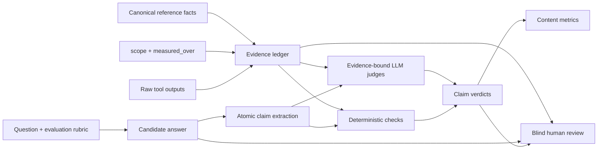

# Content evaluation design

## Purpose

System telemetry, memory utilization, and orchestration consistency are
observability problems. Content quality is different: it requires an explicit
answer model, authoritative evidence, carefully defined denominators, and
human/LLM adjudication.

The content evaluation therefore operates on atomic claims rather than grading
the final answer as one block.



## Decisions

1. `scope` and `measured_over` are provenance metadata. They explain the
   population, window, columns, operation, and filters behind a result. They do
   **not** prove that the result value is correct.
2. Raw or normalized tool results are required for numeric traceability. If
   they cannot be retained, store a durable pointer, a result hash, and the
   minimal typed values required for verification.
3. The evaluator uses LLMs to perform bounded entailment and reasoning tasks,
   not to recall facts from model memory.
4. Fact verification, must-have coverage, and logical quality are distinct
   score families. They remain visible separately.
5. No single composite content score is used initially. Weights should be
   introduced only after calibration against human reviewer preference.
6. Metrics are reported both:
   - **macro**: calculate per answer, then average answers/questions equally;
   - **micro**: pool all atomic claims.

Macro scoring stops a verbose answer from dominating the benchmark simply
because it produced more claims. Micro scoring still exposes the total volume
of correct and incorrect statements.

## Required evaluation inputs

### Question rubric

Each question may define:

- whether it is a seed, exact repeat, paraphrase, or follow-up;
- its parent question when it is a follow-up;
- must-have points;
- canonical reference facts;
- expected scope constraints;
- known invalid conclusions or logic traps.

The rubric should not contain a preferred prose answer. It should describe the
information and reasoning required for a good answer.

### Evidence ledger

Every answer is evaluated against a system-neutral evidence ledger:

```json
{
  "evidence_id": "ev_model_tsr_2025",
  "source_type": "tool_result",
  "source_system": "candidate",
  "tool": "summarize_trend",
  "call_id": "call_123",
  "arguments": {"table_name": "model_scores", "period": "month"},
  "scope": "model_scores: 2025-01..2025-12",
  "measured_over": "summarize_trend(model_scores.tsr, filters=2025)",
  "result": {"series": []},
  "result_hash": "sha256:...",
  "data_snapshot": "case-366132845011@sha256:..."
}
```

Evidence source types:

- `tool_result`: the actual result returned to an agent;
- `canonical_fact`: a human-approved fact generated from the case snapshot;
- `report_excerpt`: an exact report passage with file/line identity;
- `external_source`: an approved source used by an external competitor.

`scope` and `measured_over` accompany evidence but never replace `result`.

One call is one ledger entry. A single call is commonly captured twice — once
from the run event stream and once from the trace store — so entries are merged
on `call_id`: the first entry survives, provenance from the later capture is
unioned into it, the dropped identifier is retained in `duplicate_evidence_ids`
so a judge citing either still resolves, and an agent-level classification wins
over a tool-level one for the same call.

Each entry also carries an `evidence_tier`:

- `primary`: a `canonical_fact`, or a `tool_result` whose payload is structured
  (addressable fields, i.e. a measurement);
- `secondary`: anything else the run produced about itself — another agent's
  findings, and equally a `tool_result` that is only a prose blob, such as a
  report file the system authored earlier in the same run.

The prose rule is the ledger-level form of the same principle the numeric layer
enforces: a sentence is not a measurement. It avoids a per-system list of
"real" tools, which would otherwise be needed because a file-reading tool that
replays the system's own generated report is structurally indistinguishable
from a data tool.

### Canonical reference pack

Reference facts should be generated from a frozen case-data snapshot using
deterministic queries, then reviewed once by a domain owner. Each fact carries:

- proposition;
- entity, metric, population, and time window;
- expected value and unit, when quantitative;
- tolerance/rounding rule;
- evidence ID or deterministic query;
- importance (`critical`, `major`, `minor`).

The data snapshot hash is part of the benchmark manifest. Otherwise a fact may
be marked wrong merely because the underlying case data changed.

The reference pack does not need to anticipate every statement an answer might
make. It should cover the critical expected facts and must-haves. Additional
claims are checked against the raw evidence ledger; if no authoritative
evidence can be retrieved, they receive `UNVERIFIABLE` rather than being
guessed correct or incorrect by a judge model.

## Atomic claim model

The claim extractor is a structured-output LLM call. It extracts; it does not
judge.

```json
{
  "claim_id": "c07",
  "answer_span": "TSR rose to 0.72 in May 2025",
  "proposition": "TSR was 0.72 in May 2025 and increased relative to the prior period",
  "claim_type": "quantitative_fact",
  "entities": ["customer"],
  "metrics": ["TSR"],
  "time_window": "2025-05",
  "population": null,
  "numeric_mentions": [
    {"written": "0.72", "value": 0.72, "unit": "score"}
  ],
  "depends_on_claim_ids": [],
  "is_conclusion": false
}
```

Claim types:

- `quantitative_fact`
- `qualitative_fact`
- `comparison`
- `causal_claim`
- `inference_or_conclusion`
- `recommendation`
- `uncertainty_or_data_gap`

Extraction rules:

- Split independently falsifiable clauses.
- Preserve entity, metric, denominator/population, time window, polarity, and
  uncertainty.
- Keep a comparison and its endpoints together when splitting would destroy
  meaning.
- Recommendations are recorded but excluded from factual-accuracy
  denominators.
- A number appearing only as a date, account mask, identifier, or report
  section number is not a quantitative claim.

Example: “TSR rose to 0.72 in May and returned payments fell 15%” produces two
atomic claims.

### Claim-extraction quality controls

Claim-level metrics are invalid if the extractor silently omits difficult or
incorrect statements. Apply three controls before verification:

1. deterministic numeric-span coverage: every non-identifier number in the
   answer must belong to a claim;
2. declarative-sentence coverage: every factual sentence/clause must be covered
   by at least one claim span or explicitly labeled non-factual;
3. an omission-auditor pass that sees the answer plus extracted claims and
   returns any independently falsifiable proposition that was missed.

Report:

- numeric-span extraction coverage;
- declarative-span extraction coverage;
- omitted-claim count;
- extraction disagreement rate between primary extractor and auditor.

Critical answers with incomplete extraction are not scored automatically; they
go to human adjudication. This prevents a system from improving measured
accuracy merely by placing a false claim in a sentence the extractor skipped.

## Document-aware extraction

Do not send a flattened Markdown string directly to the claim extractor.
Parse the answer into an intermediate document structure first:

- headings;
- paragraphs;
- ordered/unordered list items;
- block quotes;
- Markdown/HTML tables;
- captions and footnotes.

Every block gets a stable `block_id`. Claims retain their source block and
exact source locator so a reviewer can return to the original presentation.

```json
{
  "block_id": "table_2",
  "source_type": "table_cell",
  "source_locator": {
    "row": 3,
    "column": 2,
    "header_path": ["Risk scores", "TSR"],
    "row_header": "May 2025"
  }
}
```

The block parser is deterministic. LLMs are used only after block structure,
headers, rows, cells, and text spans are known.

### Tables

A data cell becomes an atomic proposition by combining:

1. table caption/section context;
2. row-header path;
3. column-header path;
4. cell value;
5. units and footnote qualifiers.

Example:

| Month | TSR | Returned payments |
|---|---:|---:|
| May 2025 | 0.72 | 2 |
| June 2025 | 0.68 | 0 |

The table yields:

```text
TSR was 0.72 in May 2025.
Returned-payment count was 2 in May 2025.
TSR was 0.68 in June 2025.
Returned-payment count was 0 in June 2025.
```

Each claim points to one data cell plus its header context. The extractor does
not infer “TSR improved” from the two rows unless the answer itself states that
trend. A deterministic derived-fact stage may calculate the change later, but
the derived claim is labeled evaluator-derived rather than answer-extracted.

Table rules:

- Expand multi-level and merged headers into a full `header_path`.
- Propagate explicit table-level units, captions, and footnotes to each affected
  cell.
- Treat totals/subtotals as their own aggregation level.
- Preserve comparison columns such as “change” or “vs prior month” as the
  metric named by the header.
- Blank cells produce no claim.
- `0` is a quantitative fact.
- `N/A`, `unknown`, and `not reported` become data-availability claims only
  when the table semantics support that interpretation; they never become
  zero.
- Decorative cells and repeated formatting labels are excluded.
- A cell spanning several row entities is flagged for LLM disambiguation
  rather than duplicated blindly.

For a cell containing prose or several values, use a second cell-level
atomization pass while retaining the same table locator.

Table extraction coverage is:

\[
\text{table-cell coverage} =
\frac{\text{eligible data cells represented by at least one claim}}
{\text{eligible data cells}}
\]

It should be 100% before automatic factual scoring. Also report table-level
macro metrics so a 100-row table does not dominate the entire answer's score.

### Long sentences

Sentence boundaries are not claim boundaries. A long opening summary may
contain several facts, a comparison, and a conclusion.

Example:

> TSR rose from 0.61 to 0.72 in May, returned payments increased to two, and
> together these signals indicate higher short-term risk.

Recommended atomization:

```text
c1: TSR was 0.61 in the comparison baseline period.
c2: TSR was 0.72 in May.
c3: TSR increased from 0.61 to 0.72.              depends on c1, c2
c4: Returned-payment count was 2 in May.          shared context propagated
c5: Returned payments increased versus the comparison period.
c6: Short-term risk is higher.                    depends on c3, c5
```

The exact split depends on whether the baseline period for `c1` is stated or
recoverable. If it is ambiguous, retain the ambiguity rather than inventing a
period.

Long-sentence extraction uses two passes:

1. **clause map**
   - identify coordinated predicates, semicolon/comma clauses, comparisons,
     causal markers, and conclusion markers;
   - record exact character spans;
2. **claim atomization**
   - split each independently falsifiable proposition;
   - copy shared subject/time/population context into the child claim;
   - create dependency edges for comparisons and conclusions.

Useful split anchors include:

- coordinated verbs: “rose … and fell …”;
- contrast: “while”, “but”, “however”;
- causal/inference markers: “because”, “therefore”, “suggesting”;
- multiple metric-value pairs;
- changes in entity, period, population, or denominator.

Do not split purely because a sentence is long. Do not separate a qualifier
from the proposition it limits, and do not split a comparison in a way that
loses its endpoints.

Every child claim stores:

- its exact `answer_span`;
- `claim_group_id` for the original sentence/table row;
- inherited context fields;
- any `depends_on_claim_ids`;
- whether a field was explicit or inherited.

The omission auditor then checks that every factual clause and numeric mention
in the original long sentence is covered. The original sentence remains
visible in the human viewer, with claim spans highlighted in different colors.

## The evaluation cascade, step by step

Numeric content is judged as an ordered cascade. Each step has one question,
one decider, and one output metric, and each step's denominator is the previous
step's yes-branch. Nothing later is asked of a claim that failed earlier.

**Step 0 — atomic facts.** Python splits the final answer into blocks; the LLM
splits blocks into atomic claims; Python then guarantees one located claim per
eligible table cell. Only the final answer is evaluated. Everything else the run
produced is verification material.

**Step 1 — is the claim supported by numbers?** Asked of *every* atomic factual
claim, not only the ones that happen to contain a number. `YES` when the answer
states the values the claim rests on, `NO` when it makes a quantitative
assertion without them, `NOT_APPLICABLE` when the claim is not quantitative at
all. Output: **supported rate**. Restricting this denominator to claims that
already carry numbers makes the metric tautological — a claim would enter the
denominator *because* it had numbers, and having numbers is what scores it
`yes`, so it could only ever print 100%.

**Step 2 — can the numbers be traced back to tool output, or correctly derived
from it?** Python, never the model. A number is traceable when it is *located*
in a real tool result and *correctly obtained* from it: a direct read that
matches, or a derivation that recomputes. Derivations include `max`, `min`,
`mean`, `sum`, `count`, `difference`, `product`, `ratio`, `percent_change`, and
an operand may address a whole series, so "the peak TSR was 39.6" is checked as
`max(series) == 39.6` rather than against whichever bucket the judge pointed at.
Output: **numeric traceability rate**.

The failing branch is decomposed, because it holds several unrelated defects:

| `trace_failure` | Meaning | Hallucination? |
|---|---|---|
| `not_located` | the path resolves to nothing in the tool output | yes |
| `evidence_id_unknown` | the cited evidence does not exist | yes |
| `no_evidence_cited` | no provenance was offered for the number | yes |
| `not_a_measurement` | the path lands on prose, not a value | yes |
| `unmapped_mention` | the judge returned no entry for this mention | yes |
| `value_mismatch` | located, but the value disagrees | no — arithmetic defect |
| `not_tool_output` | resolved only from an agent summary | no — unavailable |

### What only the LLM can decide

Python owns block structure, table-cell coverage, locators, and every numeric
comparison. Clause-level splitting is not delegable, because the unit of an
atomic fact depends on how the answer STANDS BEHIND it.

An answer that says "the report cites 186 returned payments, but this is not
grounded in live specialist output; the payments table shows none" is making
one claim, not two. Split mechanically, it yields a "186 returned payments"
assertion the answer never made and then scores it false — the evaluator
inventing the very error it reports. Each claim therefore carries a `stance`:

- `asserted` — the answer stands behind it;
- `attributed_unendorsed` — it reports another source's figure without adopting it;
- `attributed_refuted` — it reports a figure and contradicts or corrects it.

For the latter two, the disowned figure is marked `quoted` and excluded from the
numeric funnel: it is not the answer's measurement. The verifying figure is
checked normally. Only a reader that understands attribution can draw that
line, so extraction stays with the LLM and Python enforces coverage around it.

### Hedged figures and label numbers

Two failure modes were manufactured by treating every number as an exact
measurement:

- **Hedges.** "~28+" asserts "about 28 or more", not "exactly 28". Each mention
  carries a `comparator` (`>=`, `>`, `<=`, `<`, `==`) parsed from the written
  form, and verification checks the relation. Observed: a true claim about a
  June-2024 TSR of 30.2 was reported as an invented number while the judge's own
  reason confirmed it.
- **Label numbers.** "30+ DPD" names the metric `times_30_dpd_max`; the measured
  value in that sentence was 2.0. Such a number is immaterial — marked material,
  it enters the traceability denominator, can never resolve, and is reported as
  a hallucination.

### Relational claims

A claim can assert something checkable while stating no number of its own.
"TSR was below its risk threshold" names no value, yet both sides are in the
tool output — the measurement and the threshold the tool itself reported.
Treating such a claim as non-quantitative means the cascade declines to verify
a statement it CAN verify, and the claim then rests on the judge's word alone.

For every `threshold`, `comparison`, or `ranking` claim the judge returns
`relations`: `{left, operator, right, reason}` with operator in
`< <= > >= == !=`, each side addressing a real tool value. Python resolves both
sides and evaluates the relation. Rules:

- both sides must resolve to `tool_result` evidence; a threshold the judge
  supplies from memory is `not_tool_output` and does not count as traced;
- a grounded relation that does not hold contradicts the claim, exactly as a
  grounded numeric mismatch does;
- a relational claim with NO relation supplied is marked
  `relation_not_supplied` and scores `unavailable` — declining to check
  something checkable is unknown, not exempt.

**Step 3 — is the tool usage correct?** Asked only of claims that passed step 2.
Two independent verdicts, ANDed: the LLM judges whether the tool, table,
columns, filters, window, population, denominator, and aggregation are
semantically appropriate; Python checks the rubric's `expected_scope` and that
the call did not fail. Output: **correct tool usage rate**, and the cascade's
terminal, **actual numeric accuracy** — the claims that cleared all three steps.

`expected_scope` is matched against the CALL — tool name plus deeply decoded
arguments plus declared provenance — never against the tool's output. Matching
the whole evidence blob passes on coincidence: a table name printed inside the
system's own prose report satisfies a constraint about which table was
queried. Supported keys: `tables`, `columns`, `aggregations`, `periods`,
`tools` (allow-list), `forbidden_tools` (deny-list, for tools that replay
self-authored artifacts), and `per_tool` overrides.

Grain constraints belong under `per_tool`. Applied globally they punish the
wrong call: a monthly `max` is the right grain for a trend tool and meaningless
for a raw row fetch that aggregates nothing, so a global rule would fail a
legitimate attribution lookup.

**Hallucination** is a claim-level terminal spanning steps 2 and 3: the value is
locatable in no tool output and derivable from none, *or* the tool used is
materially wrong, so a real number was produced by a measurement that does not
answer the claim. A located-but-mismatched value is explicitly not a
hallucination, and neither is a run with no captured provenance — that is
missing instrumentation, and reporting it as invention blames the system for a
harness gap.

**Expected answers.** For a question a script can answer outright — "how many
cards does this customer have" — no judge is consulted. A rubric-supplied value
or a `command` computes the truth in Python, and it is compared directly against
the material numbers the answer states. Output: **expected answer accuracy**,
with critical failures counted separately.

**Qualitative claims** run their own three checks — must-have coverage, logical
validity, and grounding — described in their own sections below.

## Claim verification

### Verification hierarchy

Use the cheapest and most reliable method first:

1. **Deterministic exact check**
   - entity, metric, period, unit, polarity, and value match a canonical fact
     or tool result;
   - allowed numerical tolerance is taken from the rubric, not invented after
     seeing the answer.
2. **Deterministic derived-number check**
   - identify operands in evidence;
   - reproduce the stated arithmetic;
   - check unit, denominator, and rounding.
3. **Evidence-bound LLM verification**
   - used for qualitative facts, paraphrases, multi-row synthesis, and
     comparisons that are hard to reduce deterministically;
   - judge sees only the question, atomic claim, relevant evidence, and rubric;
   - judge must cite evidence IDs and exact evidence spans/fields.
4. **Human adjudication**
   - critical contradictions;
   - low-confidence or judge-disagreement cases;
   - causal claims and material scope disputes.

### Claim verdicts

Every factual claim receives one of:

- `SUPPORTED`: evidence entails the whole atomic claim;
- `CONTRADICTED`: evidence shows that a material part is false;
- `UNVERIFIABLE`: relevant authoritative evidence is unavailable;
- `OUT_OF_SCOPE`: the claim is not answerable from the benchmark evidence;
- `NOT_FACTUAL`: recommendation/opinion, excluded from fact metrics.

Judges are allowed to return `UNVERIFIABLE`. They must not be forced to choose
supported or contradicted.

If a supposedly atomic claim is only partially supported, it is sent back to
the extractor for another split. `PARTIAL` is an extraction-quality signal,
not a final fact verdict.

## Content metrics

Let:

- \(F\) = factual atomic claims;
- \(S\) = supported factual claims;
- \(C\) = contradicted factual claims;
- \(U\) = unverifiable/out-of-scope factual claims;
- \(Q\) = quantitative factual claims;
- \(B\) = quantitative claims that state sufficient numeric support;
- \(N\) = numeric mentions in quantitative claims;
- \(T\) = numeric mentions traced to direct evidence or a verified derivation.

### Evidence attachment coverage

Claims for which the evaluator found at least one relevant evidence candidate:

\[
\text{evidence attachment coverage} =
\frac{\#\{f \in F : f\text{ has relevant evidence}\}}{|F|}
\]

This measures availability/linkage, not correctness. Contradicting evidence
still counts as attached.

### Qualitative grounding

The numeric funnel reports `not_applicable` for every claim without a material
number, so a qualitative claim — a trend reading, an attribution, the answer's
closing synthesis — would otherwise be scored on the judge's verdict alone. Let
\(Q\) be the factual claims carrying no material number. Each is assigned a
grounding tier from the evidence it cites:

- `primary`: at least one cited entry is `evidence_tier = primary`;
- `secondary`: cited entries resolve, but all are `secondary`;
- `unresolved`: identifiers were cited and none exist in the ledger;
- `none`: nothing was cited.

\[
\text{qualitative grounding rate} =
\frac{\#\{q \in Q : \text{tier} \in \{\text{primary}, \text{secondary}\}\}}{|Q|}
\]

\[
\text{qualitative primary grounding rate} =
\frac{\#\{q \in Q : \text{tier} = \text{primary}\}}{|Q|}
\]

The first rate asks whether the claim is attributable at all; the second asks
whether it rests on a measurement rather than on the system restating itself.
The scorecard reports the primary rate. `unresolved` is a distinct bucket
rather than a variant of `none` because a fabricated evidence identifier is a
hallucination signal, not a missing citation.

Grounding does not override `factual_verdict`. A claim can be `supported` with
tier `none`: the judge found the answer consistent with what it read, but the
system pointed at nothing. Keeping the two separate is what makes that gap
visible instead of resolving it silently in either direction.

### Supported-claim rate

\[
\text{supported-claim rate} = \frac{|S|}{|F|}
\]

Unverifiable claims remain in the denominator. This penalizes answers that make
claims beyond the available evidence.

Report contradicted-claim and unverifiable-claim rates over the same denominator:

\[
\text{contradicted-claim rate} = \frac{|C|}{|F|}
\]

\[
\text{unverifiable-claim rate} = \frac{|U|}{|F|}
\]

The three primary rates sum to 100%.

### Accuracy among verifiable claims (secondary)

\[
\text{accuracy among verifiable claims} = \frac{|S|}{|S| + |C|}
\]

This is diagnostic only, because it excludes unverifiable claims and can make a
poorly evidenced answer look better than it is.

### Contradiction rate

\[
\text{contradiction rate} = \frac{|C|}{|F|}
\]

Critical contradictions are also reported as a count and a pass/fail gate.

### Quantitative support rate

The numeric evaluation follows three layers. First, determine whether the answer
states enough numbers to support the atomic claim. This evaluates the presence
and sufficiency of the numeric reasoning, not whether the numbers are true:

\[
\text{quantitative support rate} =
\frac{|B|}{|Q|}
\]

It is not computed over qualitative claims.

### Numeric traceability rate

\[
\text{numeric traceability rate} = \frac{|T|}{|N|}
\]

A numeric mention is traceable when:

- it directly maps to an exact tool-output field and its value matches; or
- it is reproduced from traceable operands using a verified calculation.

A number merely appearing somewhere in a large tool response is not
traceable. The evaluator identifies the exact field or operands. Semantic
appropriateness is deliberately checked in layer 3: a June value used for a
May claim can therefore be traceable but still wrong.

Traceability may be direct or derived. For a derived value, the evidence paths,
operation, and operands are recorded and Python reproduces the calculation.

### Correct tool usage and actual numeric accuracy

Traceability alone does not establish correctness. A number can be copied
faithfully from a tool call that used the wrong table, field, filter, time
window, population, denominator, or aggregation.

The evaluator therefore records:

- tool-usage correctness: an evidence-bound LLM judges whether the selected
  tool and arguments are semantically appropriate; Python separately checks
  that the call/result exists, did not fail, and satisfies deterministic rubric
  constraints such as an allowed table;
- number correctness: Python resolves the cited tool-result fields and checks
  the direct value or reproduces the derived calculation;
- actual correctness: `YES` only when both tool usage and number correctness
  are `YES`.

\[
\text{actual numeric accuracy} =
\frac{\text{numeric claims with correct tool usage and correct numbers}}
{\text{assessable numeric claims}}
\]

When an older system did not capture tool calls/results, these trace-dependent
metrics are `N/A`. Missing instrumentation is not labeled hallucination.

### Scope accuracy

\[
\text{scope accuracy} =
\frac{\#\{\text{claims whose linked evidence matches required scope}\}}
{\#\{\text{factual claims with scope requirements}\}}
\]

Scope includes entity, population/denominator, metric, time window, filters,
and aggregation level. This is where `scope` and `measured_over` are most
valuable.

## Must-have points

Must-have evaluation is rubric-based entailment, not keyword matching.

Each must-have point defines:

- description;
- acceptable variants;
- unacceptable shallow mentions;
- required evidence type, if any;
- importance weight;
- whether it is a critical gate.

The judge returns:

```json
{
  "must_have_id": "mh_return_timing",
  "verdict": "FULL",
  "answer_spans": ["The two returns occurred in May and July"],
  "evidence_ids": ["ev_returns"],
  "reason": "The answer gives both the occurrence and timing",
  "confidence": 0.96
}
```

Verdicts:

- `FULL` = 1.0
- `PARTIAL` = 0.5
- `MISS` = 0.0
- `NOT_APPLICABLE` = excluded

\[
\text{weighted must-have recall} =
\frac{\sum_i w_i \cdot credit_i}{\sum_i w_i}
\]

Also report:

- critical must-have pass/fail;
- critical miss count;
- unweighted full-hit rate;
- partial-hit rate.

Requiring exact answer spans prevents a judge from awarding a hit because the
topic was merely mentioned. Requiring evidence IDs prevents unsupported
coverage from being treated as a successful must-have.

## Logical quality

Logic evaluation operates on an argument graph:

- factual premises;
- intermediate inferences;
- final conclusions/recommendations;
- `depends_on_claim_ids` edges.

The logic judge scores each inference edge:

- `VALID`: conclusion follows from cited premises;
- `WEAK`: plausible but missing a material bridge or qualifier;
- `INVALID`: contradicts premises or commits a scope/temporal/causal error;
- `UNVERIFIABLE`: required premise is absent.

Common errors explicitly checked:

- subset-to-population generalization;
- correlation stated as causation;
- stale period used as current state;
- denominator or aggregation change;
- contradiction between domains;
- recommendation stronger than the evidence;
- missing uncertainty when evidence is incomplete.

Report:

- valid inference rate;
- invalid inference rate;
- number of critical invalid inferences;
- 1-5 rubric scores for evidence-to-conclusion fit, scope discipline, internal
  consistency, and uncertainty calibration.

Do not use prose fluency as a proxy for logic.

## LLM judge protocol

Use separate calls:

1. atomic claim extraction;
2. evidence retrieval/mapping;
3. claim verification;
4. must-have coverage;
5. argument-graph/logic evaluation.

The evaluator records judge model, prompt version, temperature, response,
token usage, and latency separately from system-under-test metrics.

Judge requirements:

- system identity and answer source are masked;
- structured output only;
- exact answer spans and evidence IDs are mandatory;
- no parametric-world-knowledge verification;
- `UNVERIFIABLE` is an allowed result;
- temperature is zero/low and prompt version is pinned.

Recommended arbitration:

- deterministic result wins when the check is fully specified;
- critical or low-confidence claims are judged by two independent advanced
  models or prompt variants;
- disagreements go to a third judge or human;
- judge disagreement rate is reported.

Before trusting LLM judge metrics, calibrate on a human-labeled subset and
measure agreement per verdict and per must-have item. A high overall agreement
can hide poor performance on the rare but important contradiction class.

## Human comparison viewer

### Phase A - blind answer review

Show:

- question and relevant prior turns;
- randomized Answer A/B/C;
- normalized typography, with system-specific UI artifacts removed.

Hide:

- system/model identity;
- latency, tokens, team, tools;
- generated judge scores;
- system-provided provenance.

Collect:

- pairwise preference;
- completeness;
- relevance;
- clarity;
- apparent logical coherence;
- uncertainty calibration.

Fact correctness may be marked `cannot assess before evidence`.

### Phase B - evidence review

After Phase A is submitted, show:

- system-neutral canonical evidence pack;
- extracted atomic claims and preliminary verdicts;
- for instrumented AgenticSys answers: claim-to-tool links, raw/normalized tool
  results, `scope`, and `measured_over`;
- for uninstrumented external answers: “system provenance not supplied.”

The reviewer confirms/changes:

- factual verdict per flagged/critical claim;
- numeric traceability;
- scope correctness;
- must-have verdicts;
- invalid reasoning flags.

The system identity remains hidden until Phase B is submitted. Provenance shape
may make a system guessable, but withholding the answer identity still reduces
anchoring.

### Phase C - identity reveal

Reveal:

- system/version;
- automated metrics;
- judge/human disagreements;
- latency and cost metrics.

Track reviewer identity and calculate inter-rater reliability. Pairwise answer
preference should be summarized with win rate and a question-level bootstrap
confidence interval.

## Web ChatGPT as an individual competitor

Treat Web ChatGPT as `external_uninstrumented`.

Two protocols answer different questions:

1. **Question-only competitor**: Web ChatGPT receives only the conversational
   question. This tests general reasoning/helpfulness but is not a fair test of
   case-specific factual retrieval.
2. **Evidence-equal competitor (recommended for content comparison)**: Web
   ChatGPT receives the same approved case evidence packet available to the
   other systems, but not AgenticSys internal traces or `scope` /
   `measured_over`.

Do not mix these protocols in one headline comparison.

For Web ChatGPT:

- factual accuracy can still be checked against canonical evidence;
- must-have and logic metrics still apply;
- system-provided numeric traceability is `N/A`, not zero, because internal
  provenance is unavailable;
- the human reviewer sees the same neutral canonical evidence in Phase B;
- the AgenticSys-specific provenance panel is absent.

Record the Web ChatGPT product/model label shown, date/time, full prompt,
attachments/evidence packet, whether a new chat was used, and the exported
answer. Web UI model routing is less reproducible than an API-pinned model, so
report it as a distinct competitor class.

Cold questions use a new chat. Follow-up chains remain in the same chat.

## Memory utilization

Memory evaluation is driven by the question set, not inferred from wording:

```yaml
- name: payment_returns
  text: Did the customer have any payment returns?
  memory_required: false

- name: payment_returns_followup
  text: When did those returned payments occur?
  memory_required: true
```

The metric is:

\[
\text{memory hit rate} =
\frac{\text{memory-required runs where memory was used}}
{\text{memory-required runs}}
\]

For each run, `memory_used` is `true` when any memory-use signal is observed and
`false` otherwise. Questions marked `memory_required: false` or left
unannotated are excluded. This dimension measures memory usage only.

## Aggregation and gates

The experiment-level `repeats` value is the shared repetition count (k).
Every answer run is judged independently; content evaluation does not sample a
different set of generations. For each question/system, report every value by
run index together with mean, sample standard deviation, minimum, and maximum.
The mean alone is insufficient because content quality can vary materially
between generations of the same answer.

Primary content scorecard:

- supported-, contradicted-, and unverifiable-claim rates;
- accuracy among verifiable claims (secondary);
- contradiction rate and critical contradiction count;
- quantitative support rate;
- numeric traceability rate;
- scope accuracy;
- weighted must-have recall and critical-miss gate;
- valid/invalid inference rates;
- human pairwise preference.

Recommended gates:

- no critical contradicted facts;
- no critical must-have misses;
- no critical invalid inference;
- no statistically meaningful regression in human preference.

Do not choose universal numeric thresholds before collecting a baseline. Use
the previous AgenticSys version and human-reviewed calibration set to establish
acceptable ranges.

Bootstrap uncertainty at the question level, not at the atomic-claim level:
claims from the same answer are correlated and are not independent samples.

## Implementation sequence

1. Extend the AgenticSys adapter to export a complete evidence bundle, not only
   `scope` and `measured_over`.
2. Add question-rubric and canonical-fact schemas.
3. Implement atomic claim extraction and deterministic numeric checks.
4. Add evidence-bound LLM judges with stored structured outputs.
5. Calibrate judge outputs against a human-labeled subset.
6. Build the two-stage blind comparison viewer.
7. Add Web ChatGPT ingestion as an external uninstrumented submission.

The evidence bundle is the blocking dependency. Fact accuracy and numeric
traceability should not be advertised until raw/normalized tool results are
available to the evaluator.
